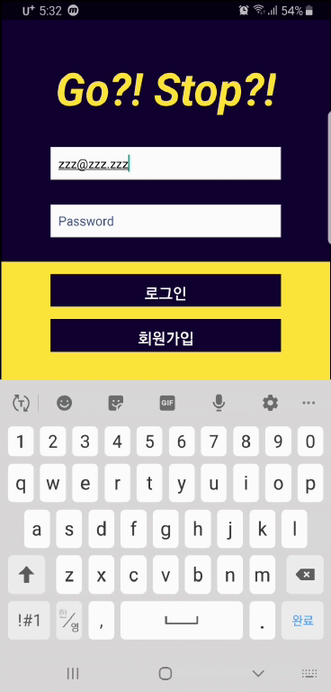
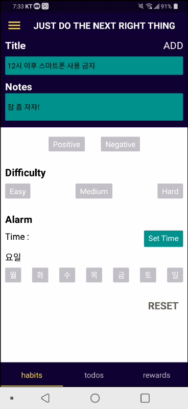
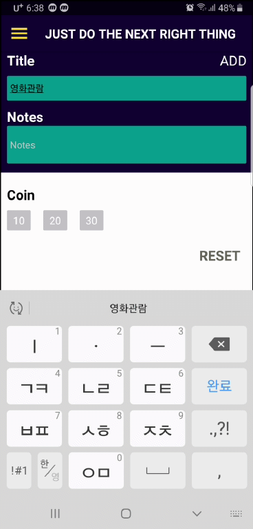
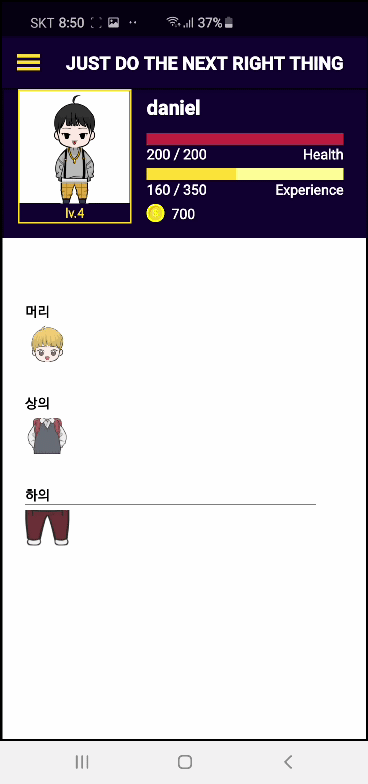
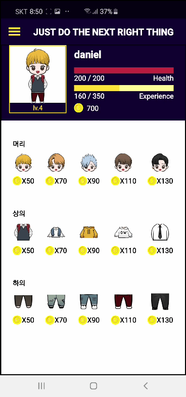

# Go?!Stop?!
 
  
> 기존 Todo 앱 + 캐릭터 키우기 기능 = 생활관리앱
> Stacks : Nodejs, Express, Typescript, multer, MongoDB, Mongoose, JWT(refresh token), AWS S3/EC2
  
  
  
  
## 미션을 완수하여 캐릭터를 성장시켜라!  여러분이 바로 그 캐릭터입니다.  
  
  
게임에서는 공격하고 있으면, 경험치가 오르고 레벨업이 되는데  

내 인생은 경험치가 오르고 레벨업 되고 있는 게 눈에 보이지 않아!  
   
**본 어플리케이션의 모든 캐릭터는 [나의 최애캐_오빠돌]의 디자인입니다.     
  
### 1. USER
- LEVEL UP
- 경험치 상승에 따른 레벨업
  

  
### 2. HABITS & TODOS
- 만들고 싶은 습관 / 없애고 싶은 습관
- 기간별로 해야 할 일들
  

  
### 3. REWARDS
- 스스로에게 주는 보상
  

  
### 4. ITEMS
- 획득한 코인으로 아이템 구입
- 캐릭터 꾸미기
  
  
  
  
***  
  
## 설치방법  

Installation  
```npm install  yarn```

Running  
```npm run dev  yarn dev```

Testing  
```npm run test  yarn test```
